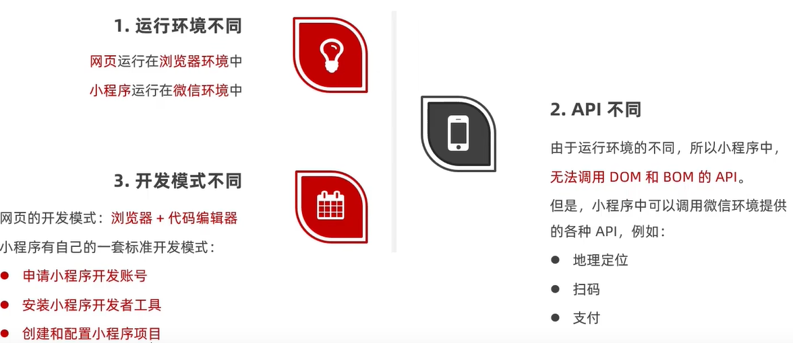
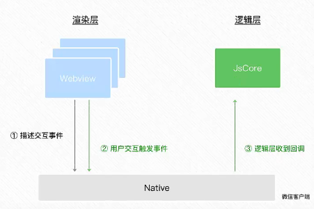
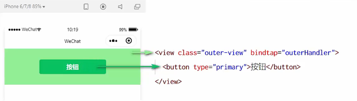
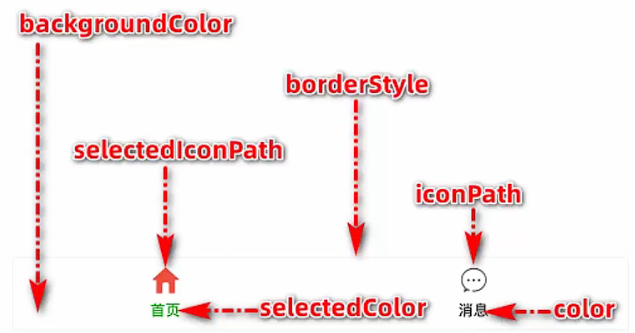
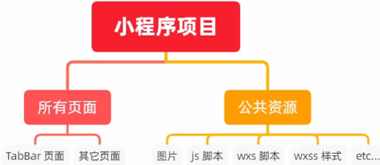
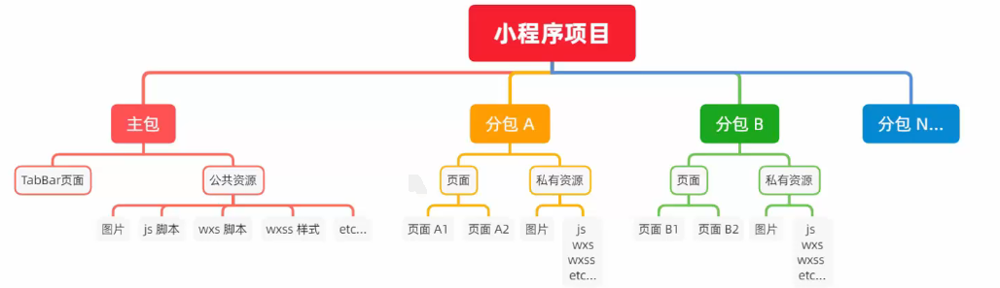
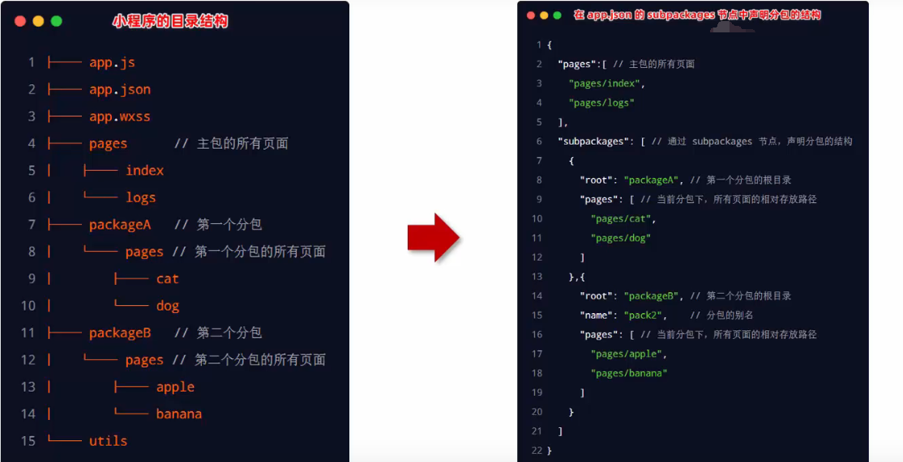
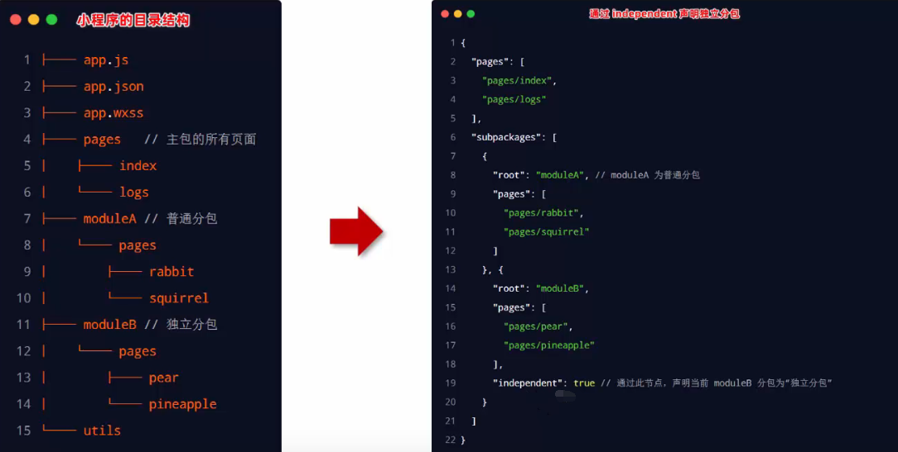

[TOC]


# 一、小程序基础

**小程序与普通页面开发的区别**：




## 1. 项目结构

### 1.1 项目的基本组成结构

1.  pages： 用来存放所有小程序的页面
2.  utils： 用来存放工具性质的模块（例如:格式化时间的自定义模块)
3.  app.js ：小程序项目的入口文件
4.  app.json： 小程序项目的全局配置文件
5.  app.wxss： 小程序项目的全局样式文件
6.  project.config.json：项目的配置文件
7.  sitemap.json：用来配置小程序及其页面是否允许被微信索引


### 1.2  页面组成部分

小程序官方建议把所有小程序的页面，都存放在**pages目录**中，以**单独的文件夹存在**,即为每一个页面都设置一个文件夹存放相关文件。

每个页面由4个基本文件组成，分别是:

-  .js文件（页面的脚本文件，存放页面的数据、事件处理函数等)
-  json文件（当前页面的配置文件，配置窗口的外观、表现等)
-  .wxml文件（页面的模板结构文件)
-  .wxss文件（当前页面的样式表文件)


### 1.3 小程序中的JSON配置文件

JSON是一种**数据格式**，在实际开发中，JSON总是以配置文件的形式出现。

小程序项目中: 通过不同的.json配置文件，可以对小程序项目进行不同级别的配置。


**app.json文件**：

app.json 是当前小程序的全局配置，包括了小程序的所有页面路径、窗口外观、界面表现、底部 tab等。

在项目默认app.json中：

```json
{
  "pages":[       //用来记录当前小程序所有页面的路径
    "pages/index/index",
    "pages/logs/logs"
  ],
  "window":{       //全局定义小程序所有页面的背景色、文字颜色等
    "backgroundTextStyle":"light",
    "navigationBarBackgroundColor": "#fff",
    "navigationBarTitleText": "Weixin",
    "navigationBarTextStyle":"black"
  },
  "style": "v2",  //全局定义小程序组件所使用的样式版本,如果删除这个节点，就会使用旧版的样式
  "sitemapLocation": "sitemap.json" //用来指明sitemap.json的路径
}
```


**project.config.json文件：**

project.config.json 是项目配置文件，用来**记录对小程序开发工具所做的个性化配置**，例如:

- setting：保存了编译相关的配置
- projectname：保存的是项目名称
- appid：保存的是小程序的账号ID


**sitemap.json文件**：

微信现已开放小程序内搜索，效果类似于PC网页的SEO。

sitemap.json 文件用来**配置小程序页面是否允许微信索引**。

当开发者允许微信索引时，微信会通过爬虫的形式，为小程序的页面内容建立索引。当用户的搜索关键字和页面的索引匹配成功的时候，小程序的页面将可能展示在搜索结果中。


**页面的.json配置文件**：

小程序中的每一个页面，可以使用.json文件来**对本页面的窗口外观进行配置**，**页面中的配置项会覆盖app.json的window中相同的配置项**。


### 1.4 新建小程序页面

只需要在==**app.json -> pages**==中新增页面的存放路径，小程序开发者工具即可帮我们自动创建对应的页面文件，如:

```json
"pages":[
    "pages/index/index",
    "pages/logs/logs",
    
    "pages/list/list"
  ],
//此时在pages文件夹下就会自动创建一个完整的页面文件夹 list
```


### 1.5 修改项目首页

只需要调整==app.json -> pages==数组中页面路径的**前后顺序**，即可修改项目的首页。

小程序会把排在第一位的页面，当作项目首页进行渲染，如:

```json
"pages":[
    "pages/index/index",  //此时因为index排在第一位，所以它是首页
    "pages/logs/logs",
    "pages/list/list"
  ],
```


## 2. 代码构成


### 2.1 WXML模板

WXML (WeiXin Markup Language)是小程序框架设计的一套标签语言，**用来构建小程序页面的结构**，其作用类似于网页开发中的HTML。


#### WXML和HTML的区别

- ==标签名称不同==:
  - HTML ( div, span, img, a)
  - WXML (view, text, image, navigator)
- ==属性节点不同==:
  - < a **href**="#">超链接< /a>
  - < navigator **url**="/pages/home/home">< /navigator>
- ==WXML提供了类似于Vue中的模板语法==:
  - 数据绑定
  - 列表渲染
  - 条件渲染


### 2.2 WXSS

wXSS (Weixin Style Sheets)是一套样式语言，用于描述WXML的组件样式，类似于网页开发中的CSS。

#### WXSS和CSS的区别

- ==新增了rpx尺寸单位==:
  - CSS中需要手动进行像素单位换算，例如rem
  - WXSS在底层支持新的尺寸单位rpx，在不同大小的屏幕上小程序会自动进行换算
- ==提供了全局的样式和局部样式==:
  - 项目根目录中的app.wxSs会作用于所有小程序页面
  - 局部页面的.wxss样式仅对当前页面生效
- ==WXSS仅支持部分CSS选择器==:
  - .class和#id
  - element
  - 并集选择器、后代选择器
  - ::after和 ::before 等伪类选择器


### 2.3 小程序中的js文件分类

小程序中的JS文件分为三大类，分别是：

- ==app.js== :
  - 是整个**小程序项目的入口文件**，通过调用**App()**函数来启动整个小程序
- ==页面的.js 文件== :
  - 是**页面的入口文件**，通过调用**Page()**函数来创建并运行页面
- ==普通的.js文件== :
  - 是普通的功能模块文件，用来封装公共的函数或属性供页面使用


# 二、 宿主环境

宿主环境( host environment）指的是==程序运行所必须的依赖环境==。例如:

**Android**系统和 **iOS**系统是两个不同的宿主环境：安卓版的微信App是不能在iOS环境下运行的，所以，Android是安卓软件的宿主环境，脱离了宿主环境的软件是没有任何意义的!

**小程序的宿主环境**：

手机微信是小程序的宿主环境，小程序借助宿主环境提供的能力，可以完成许多普通网页无法完成的功能，例如:微信扫码、微信支付、微信登录、地理定位、etc...


**小程序宿主环境包含的内容**：

1.  通信模型
2.  运行机制
3.  组件
4.  API


## 1. 通信模型

### 1.1 通信的主体

小程序中通信的主体是**渲染层**和**逻辑层**，其中:

- WXML模板和WXSS样式工作在渲染层
- JS脚本工作在逻辑层

### 1.2 小程序的通信模型

小程序中的通信模型分为两部分:

- **渲染层**和**逻辑层**之间的通信
  - 由微信客户端进行转发
- **逻辑层**和**第三方服务器**之间的通信
  - 由微信客户端进行转发


## 2. 运行机制

### 2.1 小程序启动的过程

1.  把小程序的代码包下载到本地
2.  解析app.json全局配置文件
3.  执行app.js 小程序入口文件，调用App()创建小程序实例
4.  渲染小程序首页
5.  小程序启动完成


### 2.2 页面渲染过程

1.  加载解析页面的.json配置文件
2.  加载页面的.wxml模板和.wxss样式
3.  执行页面的.js 文件，调用Page()创建页面实例
4.  页面渲染完成


## 3. 组件

### 3.1 小程序组件的分类

**小程序中的组件也是由宿主环境提供的**，开发者可以基于组件快速搭建出漂亮的页面结构。

官方把小程序的组件分为了9大类，分别是:

1.  **视图容器**
2.  **基础内容**
3.  **表单组件**
4.  **导航组件**
5.  媒体组件
6.  map 地图组件
7.  canvas画布组件
8.  开放能力
9.  无障碍访问


### 3.2 常用视图容器类组件

- ==view==：

  - 普通视图区域
  - 类似于HTML中的div，是一个块级元素
  - 常用来实现页面的布局效果

- ==scroll-view==：

  - 可滚动的视图区域

  - 常用来实现滚动列表效果

  - 基本使用：

    ```html
    第一步
    //为scroll-view添加 scroll-y 或scroll-x
    //scroll-y 属性:允许纵向滚动
    //scroll-x属性:允许横向滚动
    //注意:使用竖向滚动时，必须给scroll-view —个固定高度
    <scroll-view  class="aa"  scroll-y></scroll-view>
    
    第二步
    //纵向滚动情况下，为标签添加高度
    ```

    

- ==swiper 和 swiper-item==：

  - 轮播图容器组件和轮播图item组件

    

#### swiper常用属性

| 属性                   | 类型    | 默认值        | 说明               |
| ---------------------- | ------- | ------------- | ------------------ |
| indicator-dots         | boolean | flase         | 是否显示面板指示点 |
| indicator-color        | color   | rgba(0,0,0,3) | 指示点颜色         |
| indicator-active-color | color   | #000000       | 指示点颜色         |
| rautoplay              | boolean | flase         | 是否自动切换       |
| interval               | number  | 5000          | 自动切换时间间隔   |
| circular               | boolean | flase         | 是否采用衔接滑动   |


### 3.3 常用基础内容组件

- ==text==：
  - 文本组件
  - 类似于HTML 中的span标签，是一个行内元素
- ==rich-text==：
  - 富文本组件
  - 支持把HTML字符串渲染为WXML结构

#### text组件的基本使用

通过text组件的 **selectable** 属性【只有text组件支持这个效果】，实现长按选中文本内容的效果。


#### rich-text组件的基本使用

通过rich-text 组件的 **nodes** 属性节点，把 HTML字符串渲染为对应的UI结构:

```html
<rich-text nodes="<h1 style='color:red;'>标题</h1>"></rich-text>
```


### 3.4 其他常用组件

- button
  - 按钮组件
  - 功能比 HTML中的 button 按钮丰富
  - 通过open-type属性可以调用微信提供的各种功能（客服、转发、获取用户授权、获取用户信息等)
- image
  - 图片组件
  - image 组件默认宽度约300px、高度约240px
- navigator (导航组件)
  - 页面导航组件
  - 类似于HTML中的a链接


#### button按钮基本使用

```html
<view>-------通过type指定按钮类型-------</view>
<button>默认按钮</button>
<button type="primary">主色调按钮</button>
<button type="warn">警告按钮</button>

<view>-------size="mini"小尺寸按钮-------</view>
<button size="mini">默认按钮</button>
<button type="primary" size="mini">主色调按钮</button>
<button type="warn" size="mini">警告按钮</button>

<view>-------plain镂空按钮-------</view>
<button size="mini" plain>默认按钮</button>
<button type="primary" size="mini" plain>主色调按钮</button>
<button type="warn" size="mini" plain>警告按钮</button>
```


#### image组件的mode属性

image组件的 **mode** 属性用来指定图片的裁剪和缩放模式，常用的mode 属性值如下:

| mode值      | 说明                                                         |
| ----------- | ------------------------------------------------------------ |
| scaleToFill | (默认值）缩放模式，**不保持纵横比缩放图片**，使图片的宽高完全拉伸至**填满image元素** |
| aspectFit   | 缩放模式，**保持纵横比缩放图片，使图片的长边能完全显示出来**。可以完整地将图片显示出来。 |
| aspectFill  | 缩放模式，**保持纵横比缩放图片，只保证图片的短边能完全显示出来**。图片通常只在水平或垂直方向是完整的,另一个方向将会发生截取。 |
| widthFix    | 缩放模式，**宽度不变，高度自动变化**，保持原图宽高比不变，影响盒子大小 |
| heightFix   | 缩放模式，**高度不变，宽度自动变化**，保持原图宽高比不变，影响盒子大小 |


## 4. API

小程序中的API是由宿主环境提供的，通过这些丰富的小程序API，开发者可以方便的调用微信提供的能力，例如:获取用户信息、本地存储、支付功能等。


### 4.1 小程序API的分类

- ==事件监听API==：
  - 特点:以on开头，用来监听某些事件的触发
  - 举例: wx.onWindowResize(function callback)监听窗口尺寸变化的事件
- ==同步API==：
  - 特点1:以Sync结尾的API都是同步API
  - 特点2:同步API的执行结果，可以通过函数返回值直接获取，如果执行出错会抛出异常
  - 举例: wx.setStorageSync('key' , 'value') 向本地存储中写入内容
- ==异步API==：
  - 特点:类似wjQuery 中的$.ajax(options)函数，需要通过success、fail、complete接收调用的结果
  - 举例: wx.request()发起网络数据请求，通过success回调函数接收数据


# 三、模板与配置

## 1. WXML模板语法

### 1.1 数据绑定

**数据绑定基本原则**：

- 在data中定义数据
- 在WXML中使用数据

**在data中定义数据**：

在页面对应的.js 文件中，==把数据定义到data对象中==即可：

```js
Page({
    data:{
        //字符串类型的数据
        info:'init data',
        //数组类型的数据
        msgList:[{msg:'hello'}, {msg:'world'}]
    }
})
```

#### Mustache语法【插值表达式】

Mustache语法的主要应用场景如下:

- 绑定内容
- 绑定属性
- 运算（三元运算、算术运算等)

**绑定内容：**

把data中的数据绑定到页面中渲染，使用Mustache语法（双大括号）将变量包起来即可。语法格式为:

```html
<view>{{数据名称}}</view>
```


**绑定属性：**

```html
Page({
    data:{
        img:'http:////'
    }
})
-----------------------
<image src="{{img}}"></image>
```


**三元运算：**

```html
Page({
    data:{
      rand:Math.random()*10
    }
})
--------------------------
<view>{{ rand >= 5 ? '随机数大于等于5' : '随机数小于5' }}</view>
```


**算术运算：**

```html
Page({
    data:{
      rand:Math.random().toFixed(2) //随机产生一个保留两位的小数
    }
})
----------------------------------------------
<view>{{ rand * 100 }}</view>
```


### 1.2 事件绑定

事件是==渲染层到逻辑层的通讯方式==。通过事件可以将用户在渲染层产生的行为，反馈到逻辑层进行业务的处理。



#### 小程序中常用的事件

| 类型   | 绑定方式                | 事件描述                                     |
| ------ | ----------------------- | -------------------------------------------- |
| tap    | bindtap 或 bind:tap     | 手指触摸后马上离开，类似于HTML中的click 事件 |
| input  | bindinput 或 bind:input | 文本框的输入事件                             |
| change | bindinput 或 bind:input | 状态改变时触发                               |


#### 事件对象的属性列表

当事件回调触发的时候，会收到一个事件对象**event**，它的详细属性如下表所示:

| 属性           | 类型       | 说明                                         |
| -------------- | ---------- | -------------------------------------------- |
| type           | String     | 事件类型                                     |
| timeStamp      | Integer    | 页面打开到触发事件所经过的毫秒数             |
| ==target==     | ==Object== | ==触发事件的组件的一些属性值集合==           |
| currentTarget  | Object     | 当前组件的一些属性值集合                     |
| ==detail==     | ==Object== | ==额外的信息==                               |
| touches        | Array      | 触摸事件，当前停留在屏幕中的触摸点信息的数组 |
| changedTouches | Array      | 触摸事件，当前变化的触摸点信息的数组         |

**currentTarget 与 taget 的区别**：

- target是触发该事件的源头组件，
- currentTarget则是当前事件所绑定的组件。

举例如下:



点击内部的按钮时，点击事件以==冒泡==的方式向外扩散，也会触发外层view的 tap事件处理函数。

此时，对于外层的view来说:

- e.target指向的是触发事件的源头组件，因此，**e.target是内部的按钮组件**
- e.currentTarget指向的是当前正在触发事件的那个组件，因此，**e.currentTarget是当前的view组件**


#### 为data中的数据赋值

通过调用==this.setData(dataObject)==方法，可以给页面data中的数据重新赋值，示例如下:

```js
Page({
    data:{
        count:0
    },
    changeCount(){
        this.setData({
          count:this.data.count+1
        })
    }
})
```


#### 事件传参

小程序中的事件传参比较特殊，<span style="color:red">不能在绑定事件的同时为事件处理函数传递参数</span>。如

```html
<button type="primary" bindtap='btnHandler(123)'>事件传参</button>
```

小程序会把 bindtap的属性值，统一当作事件名称来处理，相当于要调用一个名称为btnHandler(123)的事件处理函数。

**传参：**

可以为组件提供data-xxxx自定义属性传参，其中xxx代表的是参数的名字，示例代码如下:

```html
<button bindtap="btnHandler" data-info="{{2}}">事件传参</button>
//这里如果省略{{}}，直接写 data-info="2"，那么参数是字符串2
```

最终:

- info会被解析为 **参数的名字**
- 数值 ⒉会被解析为 **参数的值**


**获取参数：**

在事件处理函数中，通过 ==event.target.dataset.参数名== 即可获取到具体参数的值，示例代码如下:

```js
btn(e){
   //dataset是一个对象，包含了所有通过data-* 传递过来的参数项
    console.log(e.target.dataset)
   //通过dataset可以访问到具体参数的值
    console.log(e.target.dataset.info)
}
```


#### bindinput基本使用

通过input 事件来响应文本框的输入事件：

```html
<input bindinput="inputHandler"></input>
-----------------------------
inputHandler(e){
// e.detail.value是变化过后，文本框最新的值
console.log(e.detail.value)
}
```


### 1.3 条件渲染

#### wx : if

在小程序中，使用==wx:if==="{{ condition }}"来判断是否需要渲染该代码块:

```html
<view wx:if="{{ condition }}">True</view>
```

也可以用 ==wx:elif== 和 ==wx:else== 来添加else判断:

```html
<view wx:if="{{ type==1 }}">1</view>
<view wx:elif="{{ type==2 }}">2</view>
<view wx:else>3</view>
```


#### 结合< block>使用wx：if

如果要一次性控制多个组件的展示与隐藏，可以使用一个< block>< /block>标签将多个组件包装起来，并在< block>标签上使用wx:if 控制属性，示例如下:

```html
<block wx:if="{{true}}">
    <view>1</view>
    <view>2</view>
</block>
```

注意: ==< block>并不是一个组件==，它只是一个包裹性质的容器，不会在页面中做任何渲染。


#### hidden

在小程序中，直接使用==hidden==="{{condition }}"也能控制元素的显示与隐藏:

```html
<view hidden="{{ condition }}">条件为 true隐藏，条件为 false 显示</view>
```


#### wx:if 与 hidden 的区别

运行方式不同：

- wx:if： 以动态创建和移除元素的方式，控制元素的展示与隐藏
- hidden ：以切换样式的方式（display: none/block; )，控制元素的显示与隐藏

使用场景：

- 频繁切换时，建议使用hidden
- 控制条件复杂时，建议使用wx:if 搭配 wx:elif、wx:else进行展示与隐藏的切换


### 1.4 列表渲染

#### wx : for

通过==wx:for== 可以根据指定的数组，循环渲染重复的组件结构，语法示例如下:

```html
<view wx:for="{{list}}">
  索引是{{index}},当前项是{{item}}
</view>
```

- 默认情况下，当前循环项的索引用index表示;当前循环项用item表示。
- 使用 ==wx:for-index== 可以指定当前循环项的索引的变量名
- 使用 ==wx:for-item== 可以指定当前项的变量名

```html
<view wx:for="{{list}}" wx:for-index="idx" wx:for-item="ite">
  索引是{{idx}},当前项是{{ite}}
</view>
```


#### wx : key

类似于Vue列表渲染中的:key，小程序在实现列表渲染时，也建议为渲染出来的列表项指定唯一的key值,从而**提高渲染的效率**，示例代码:

```html
//data数据
data: {
  userlist: [
     { id: 1,name: '小红’},
     { id: 2,name: '小黄'},
     { id: 3,name: '小白’}
  ]
}

//wxml结构
<view wx:for="{{userlist})" wx:key="id">{{item.name}}</view>
```


## 2. WXSS模板样式

WXSS具有CSS大部分特性，同时，WXSS还对CSS进行了扩充以及修改，以适应微信小程序的开发。与CSS相比，WXSS扩展的特性有:

- ==rpx==尺寸单位
- ==@import==样式导入

### 2.1 rpx单位

rpx ( responsive pixel）是微信小程序独有的，用来**解决屏适配的尺寸单位**。

实现原理：

- rpx的实现原理非常简单:鉴于不同设备屏幕的大小不同，为了实现屏幕的自动适配，**rpx把所有设备的屏幕，在宽度上等分为750份**（即:当前屏幕的总宽度为750rpx)。


### 2.2 样式导入

@import后跟需要导入的外联样式表的==相对路径==，用;表示语句结束。示例如下:

```css
@import "common.wxss";
```


### 2.3 全局样式与局部样式

- 当局部样式和全局样式冲突时，根据就近原则，局部样式会覆盖全局样式
- 当局部样式的权重大于或等于全局样式的权重时，才会覆盖全局的样式


## 3. 全局配置

### 3.1 全局配置文件及常用的配置项

小程序根目录下的==app.json==文件是小程序的==全局配置文件==。常用的配置项如下:

- pages
  - 记录当前小程序所有页面的存放路径
- window
  - 全局设置小程序窗口的外观
- tabBar
  - 设置小程序底部的tabBar效果
- style
  - 是否启用新版的组件样式


### 3.2 全局配置-节点window

#### window节点常用配置项

| 属性名                       | 类型     | 默认值  | 说明                                           |
| ---------------------------- | -------- | ------- | ---------------------------------------------- |
| navigationBarTitleText       | String   | 字符串  | 导航栏标题文字内容                             |
| navigationBarBackgroundColor | HexColor | #000000 | 导航栏背景颜色，如#000000                      |
| navigationBarTextStyle       | String   | white   | 导航栏标题颜色，仅支持black / white            |
| backgroundColor              | HexColor | #ffffff | 窗口的背景色                                   |
| backgroundTextStyle          | String   | dark    | 下拉loading的样式，仅支持dark / light          |
| enablePullDownRefresh        | Boolean  | false   | 是否全局开启下拉刷新                           |
| onReachBottomDistance        | Number   | 50      | 页面上拉触底事件触发时距页面底部距离，单位为px |

在 app.json中启用下拉刷新功能，会作用于每个小程序页面!


### 3.3 全局配置-tabBar节点

**默认没有改节点，需要自己手动添加**。

tabBar是移动端应用常见的页面效果，**用于实现多页面的快速切换**。小程序中通常将其分为:

- 底部 tabBar
- 顶部 tabBar

==注意==：

- tabBar中只能配置最少2个、最多5个tab页签
- 当渲染顶部 tabBar时，不显示 icon，只显示文本

####  tabBar的组成部分



1.  **backgroundColor**: tabBar的背景色
2.  **selectedlconPath**: 选中时的图片路径
3.  **borderStyle**: tabBar 上边框的颜色
4.  **iconPath**: 未选中时的图片路径
5.  **selectedColor**: tab 上的文字选中时的颜色
6.  **color**: tab 上文字的默认（未选中）颜色


#### tabBar配置项

| 属性            | 类型     | 必填 | 默认值 | 说明                                    |
| --------------- | -------- | ---- | ------ | --------------------------------------- |
| position        | String   | 否   | bottom | tabBar的位置，仅支持bottom/top          |
| borderStyle     | String   | 否   | black  | tabBar 上边框的颜色，仅支持black/white  |
| color           | HexColor | 否   |        | tab 上文字的默认（未选中）颜色          |
| selectedColor   | HexColor | 否   |        | tab 上的文字选中时的颜色                |
| backgroundColor | HexColor | 否   |        | tabBar的背景色                          |
| list            | Array    | 是   |        | tab页签的列表，==最少2个、最多5个tab==. |

```json
{
  "pages":[
    .......
  ],
  "window":{
    ........
  },
  "tabBar": {
    "list":[
        {},//tab项
        {}
    ]
  },
}
```


#### 每个tab项的配置选项

| 属性             | 类型   | 必填 | 说明                                                 |
| ---------------- | ------ | ---- | ---------------------------------------------------- |
| pagePath         | String | 是   | 页面路径，页面必须在pages中预先定义                  |
| text             | String | 是   | tab 上显示的文字                                     |
| iconPath         | String | 否   | **未选中**时的图标路径;当postion为top 时，不显示icon |
| selectedlconPath | String | 否   | **选中时**的图标路径;当postion 为top时，不显示icon   |

```json
{
  "pages":[
    "pages/list/list",
    "pages/index/index",
    "pages/logs/logs"
  ],
  "window":{
   ..........
  },
  "tabBar": {
   "list":[
      {
          "pagePath":"pages/list/list",
          "text":"list"
      },
      {
          "pagePath":"pages/index/index",
          "text":"index"
      }
  ]
  },
}
```

==注意==：

- tabBar的页面在pages节点中，必须靠前


## 4. 页面配置

- 页面配置文件的作用：
  - 小程序中，每个页面都有自己的.json配置文件，用来对当前页面的窗口外观、页面效果等进行配置。
- ==页面配置和全局配置的关系==:
  - 小程序中，每个页面都有自己的.json配置文件，用来对当前页面的窗口外观、页面效果等进行配置。
  - 如果某些小程序页面想要拥有特殊的窗口表现，此时，“页面级别的.json配置文件”就可以实现这种需求
  - 当页面配置与全局配置冲突时，根据就近原则，最终的效果以页面配置为准。


#### 页面配置中的常用配置项

| 属性                         | 类型     | 默认值  | 描述                                           |
| ---------------------------- | -------- | ------- | ---------------------------------------------- |
| navigationBarBackgroundColor | HexColor | #000000 | 当前页面导航栏背景颜色，如#000000              |
| navigationBarTextStyle       | String   | white   | 当前页面导航栏标题颜色，仅支持black / white    |
| navigationBarTitleText       | String   |         | 当前页面导航栏标题文字内容                     |
| backgroundColor              | HexColor | #ffffff | 当前页面窗口的背景色                           |
| backgroundTextStyle          | String   | dark    | 当前页面下拉loading的样式,仅支持dark / light   |
| enablePullDownRefresh        | Boolean  | false   | 是否为当前页面开启下拉刷新的效果               |
| onReachBottomDistance        | Number   | 50      | 页面上拉触底事件触发时距页面底部距离，单位为px |


## 5. 网络数据请求

### 5.1 小程序中网络数据请求的限制

出于安全性方面的考虑，小程序官方对数据接口的请求做出了两个限制：

- **只能请求HTTPS类型的接口**
- 必须将**接口的域名**添加到**信任列表**中


### 5.2 配置request合法域名

需求描述:假设在自己的微信小程序中，希望请求https://www.escook.cn域名下的接口

配置步骤: 登录微信小程序管理后台→开发→开发设置→服务器域名→修改request 合法域名

注意：

- 域名只支持 https协议
- 域名不能使用IP地址或localhost
- 域名必须经过ICP备案
- 服务器域名一个月内最多可申请5次修改


### 5.3 发起GET请求

调用微信小程序提供的 ==wx.request()== 方法，可以发起GET数据请求，示例代码如下:

```js
//在list.js中
getinfo() {
    wx.request({
      url: 'https://www.escook.cn/api/get', //请求的接口地址，必须基于https协议
      method: 'GET',
      data: { //发送到服务器的数据
        name: 'zs',
        age: 22
      },
      success: (res) => { //请求成功之后的回调函数
        console.log(res)
      }
    })
  }
------------------
//在list.wxml中
<buttom bindtap="getinfo">发起GET请求</buttom>
```


### 5.4 发起POST请求

调用微信小程序提供的==wx.request()==方法，可以发起POST 数据请求，示例代码如下:

```js
    wx.request({
      url: 'https://www.escook.cn/api/post', 
      method: 'POST',
      data: { //发送到服务器的数据
        name: 'ls',
        gender:'男'
      },
      success: (res) => { //请求成功之后的回调函数
        console.log(res)
      }
    })
```


### 5.5 在页面刚加载时请求数据

在很多情况下，我们需要在==页面刚加载的时候，自动请求一些初始化的数据==。此时需要在页面的==**onLoad**==事件中调用获取数据的函数，示例代码如下:

```js
onLoad(){
    this.a();
    this.b()
}
a(){
    ...
},
    
b(){
   ...     
    }
```


### 5.6 跳过request合法域名校验

如果后端程序员仅仅提供了http协议的接口、暂时没有提供 https协议的接口。

此时为了不耽误开发的进度，可以在微信开发者工具中，临时开启==「开发环境不校验请求域名、TLS版本及HTTPS证书」==选项，跳过request合法域名的校验。

注意：

- 跳过request合法域名校验的选项，仅限在开发与调试阶段使用!


### 5.7 小程序跨域和ajax说明

- **跨域问题**：只存在于基于浏览器的Web 开发中。由于小程序的宿主环境不是浏览器，而是微信客户端，所以小程序中不存在跨域的问题。
- **Ajax**: Ajax技术的核心是依赖于浏览器中的XMLHttpRequest这个对象，由于小程序的宿主环境是微信客户端，所以**小程序中不能叫做“发起Ajax请求”**，而是叫做“发起网络数据请求”。


# 四、视图与逻辑

## 1. 页面导航

页面导航指的是**页面之间的相互跳转**。例如，浏览器中实现页面导航的方式有如下两种:

1.  < a>链接
2.  location.href


**小程序中页面导航的两种方式：**

- 声明式导航
  - 在页面上声明一个< navigator>导航组件
  - 通过点击< navigator>组件实现页面跳转
- 编程式导航
  - 调用小程序的导航APl，实现页面的跳转

### 1.1 声明式导航

#### 跳转到tabBar页面

tabBar 页面指的是被配置为tabBar的页面。
在==使用< navigator>组件跳转到指定的tabBar页面时，需要指定url属性和open-type属性==，其中:

- url表示要跳转的==页面的地址==，必须以 ==/== 开头
- open-type表示==跳转的方式==，必须为==switchTab==.

```html
<navigator url=" /pages/message/message" open-type="switchTab">导航到消息页面</navigator>
```


#### 跳转到非tabBar页面

在==使用< navigator>组件跳转到普通的非 tabBar页面时，则需要指定url属性和open-type属性==，其中:

- url表示要跳转的页面的地址，必须以 ==/== 开头.
- open-type表示跳转的方式，必须为==navigate==.

**注意**:

- 为了简便，在导航到非tabBar页面时，open-type="nagigate"属性可以省略。


#### 后退导航

如果要后退到上一页面或多级页面，则需要指定==open-type属性==和==delta属性==，其中:

- open-type的值必须是navigateBack，表示要进行后退导航
- delta的值必须是数字，表示要后退的层级

```html
<navigator open-type='navigateBack' delta='1'>返回上一页</navigator>
```

注意:

- 为了简便，如果只是后退到上一页面，则可以省略delta属性，因为其默认值就是1。


### 1.2 编程式导航

#### 导航到tabBar页面

调用==wx.switchTab(0bject object)==方法，可以跳转到tabBar页面。其中 Object参数对象的属性列表如下:

| 属性     | 类型     | 是否必选 | 说明                                               |
| -------- | -------- | -------- | -------------------------------------------------- |
| url      | string   | 是       | 需要跳转的tabBar页面的路径，路径后==不能带参数==。 |
| success  | function | 否       | 接口调用成功的回调函数                             |
| fail     | function | 否       | 接口调用失败的回调函数                             |
| complete | function | 否       | 接口调用结束的回调函数（调用成功、失败都会执行)    |

```js
<button bindtap="gotoMessage">跳转到消息页面</button>
------------------------------------------------------------
gotoMessage(){
    wx.switchTab({
        url:'/pages/message/message'
    })
}
```


#### 导航到非tabBar页面

调用==wx.navigateTo(Object object)==方法，可以跳转到非tabBar的页面。其中 Object 参数对象的属性列表如下:

| 属性     | 类型     | 是否必选 | 说明                                                 |
| -------- | -------- | -------- | ---------------------------------------------------- |
| url      | string   | 是       | 需要跳转的非tabBar页面的路径，路径后==可以带参数==。 |
| success  | function | 否       | 接口调用成功的回调函数                               |
| fail     | function | 否       | 接口调用失败的回调函数                               |
| complete | function | 否       | 接口调用结束的回调函数（调用成功、失败都会执行)      |

```js
<button bindtap="gotoMessage">跳转到消息页面</button>
------------------------------------------------------------
gotoMessage(){
    wx.navigateTo({
        url:'/pages/message/message'
    })
}
```


#### 后退导航

调用==wx.navigateBack(Object object)==方法，可以返回上一页面或多级页面。其中 Object 参数对象可选的属性列表如下:

| 属性     | 类型     | 默认值 | 是否必选 | 说明                                               |
| -------- | -------- | ------ | -------- | -------------------------------------------------- |
| delta    | number   | 1      | 否       | 返回的页面数,如果delta大于现有页面数，则返回到首页 |
| success  | function |        | 否       | 接口调用成功的回调函数                             |
| fail     | function |        | 否       | 接口调用失败的回调函数                             |
| complete | function |        | 否       | 接口调用结束的回调函数（调用成功、失败都会执行)    |


### 1.3 导航传参

#### 声明式导航传参

navigator组件的url属性用来指定将要跳转到的页面的路径。同时，==路径的后面还可以携带参数==:

- 参数与路径之间使用?分隔
- 参数键与参数值用=相连
- 不同参数用&分隔

```js
<navigator url=" /pages/message/message?name=zs&age=14" >导航到消息页面</navigator>
```


#### 编程式导航传参

调用wx.navigateTo(Object object)方法跳转页面时，也可以携带参数，代码示例如下:

```js
<button bindtap="gotoMessage">跳转到消息页面</button>
------------------------------------------------------------
gotoMessage(){
    wx.navigateTo({
        url:'/pages/message/message?name=zs&age=14',
    })
}
```


#### 在onLoad中接收导航参数

通过==声明式导航传参==或==编程式导航传参==所携带的参数，可以直接在onLoad事件中直接获取到，示例代码如下:

```js
onLoad(options){
//options就是导航传递过来的参数对象
console.log(options)
}
```


## 2. 页面事件

### 2.1 下拉刷新事件

下拉刷新是移动端的专有名词，指的是通过手指在屏幕上的下拉滑动操作，从而重==新加载页面数据==的行为。

#### 启用下拉刷新

启用下拉刷新有两种方式:

- ==全局开启下拉刷新==：
  - 在app.json的window节点中，将enablePullDownRefresh设置为true
- ==局部开启下拉刷新==：
  - 在页面的.json配置文件中，将enablePullDownRefresh设置为true

在实际开发中，==推荐使用第2种方式==，为需要的页面单独开启下拉刷新的效果。


#### 配置下拉刷新窗口的样式

在全局或页面的.json配置文件中，通过==backgroundColor==和==backgroundTextStyle==来配置下拉刷新窗口的样式，其中:

- backgroundColor用来配置下拉刷新窗口的背景颜色，仅支持16进制的颜色值
- backgroundTextStyle 用来配置下拉刷新loading 的样式，仅支持dark和 light


#### 监听页面的下拉刷新事件

在页面的.js文件中，通过 ==onPullDownRefresh()== 函数即可监听当前页面的下拉刷新事件。


#### 停止下拉刷新的效果

当处理完下拉刷新后，下拉刷新的loading 效果会一直显示，不会主动消失，所以需要手动隐藏loading 效果。此时，调用==wx.stopPullDownRefresh()==可以停止当前页面的下拉刷新。


### 2.2 上拉触底事件

上拉触底是移动端的专有名词，通过手指在屏幕上的上拉滑动操作，从而==加载更多数据的行为==。

#### 监听页面的上拉触底事件

在页面的.js文件中，通过==onReachBottom()==函数即可监听当前页面的上拉触底事件。


#### 配置上拉触底的距离

上拉触底距离指的是触发上拉触底事件时，==滚动条距离页面底部的距离==。

可以在全局或页面的.json配置文件中，通过==onReachBottomDistance==属性来配置上拉触底的距离。


### 2.3 添加loading效果

#### 添加提示效果

```js
getColors() {
    //发起的网络请求之前添加wx.showLoading(Object object),具体属性见微信开发手册
    wx.showLoading({title:'数据加载中'})
    wx.request({
      url: 'url',
      method: 'GET',
      success: (res) => {},
      //无论请求成功还是失败都隐藏loading效果
      complete:()=>{
          wx.hideLoading()
      }
    })
  },
```


## 3. 生命周期

生命周期(Life Cycle)是指一个对象从创建→运行->销毁的整个阶段，强调的是一个时间段。

可以把每个小程序运行的过程，概括为生命周期:

- 小程序的启动，表示生命周期的开始
- 小程序的关闭，表示生命周期的结束
- 中间小程序运行的过程，就是小程序的生命周期


### 3.1 生命周期的分类

在小程序中，生命周期分为两类，分别是:

- 应用生命周期
  - 特指小程序从启动->运行->销毁的过程
- 页面生命周期
  - 特指小程序中，每个页面的加载->渲染->销毁的过程

其中，==页面==的==生命周期范围**较小**==，==应用程序==的==生命周期范围**较大**==。


### 3.2 生命周期函数的分类

小程序中的生命周期函数分为两类，分别是:

- 应用的生命周期函数
  - 特指小程序从启动->运行→销毁期间依次调用的那些函数
- 页面的生命周期函数
  - 特指小程序中，每个页面从加载->渲染->销毁期间依次调用的那些函数


### 3.3 应用的生命周期函数

小程序的应用生命周期函数需要在 ==app.js==中进行声明，示例代码如下:

```js
App({
   //小程序初始化完成时，执行此函数，全局只触发一次。可以做一些初始化的工作。
    onLaunch(options){ },
    
   //小程序启动，或从后台进入前台显示时触发。
    onShow(options){ },
    
   //小程序从前台进入后台时触发。
   onHide() { }
})

```


### 3.4 页面的生命周期函数

小程序的页面生命周期函数需要==在页面的.js文件中进行声明==，示例代码如下:

```js
Page({
    onLoad (options) { },    //监听页面加载，一个页面只调用1次
    onShow : function() { }, //监听页面显示
    onReady : function(){ }, //监听页面初次渲染完成，一个页面只调用1次
    onHide: function(){ },   //监听页面隐藏
    onUnload: function() { } //监听页面卸载，一个页面只调用1次
})
```


## 4. wxs脚本

wxs (WeiXin Script〉是==小程序独有的一套脚本语言==，结合WXML，可以构建出页面的结构。

应用场景：

wxml 中无法调用在页面的.js 中定义的函数，但是，==wxml中可以调用wxs中定义的函数==。

因此，小程序中wxs的典型==应用场景就是“过滤器”==。

注意：

- 在wxs中定义的函数==不能作为组件的事件回调函数==。
- wxs不能调用小程序提供的API
- wxs 中无法调用在页面的.js 中定义的函数
- wxs不能调用小程序提供的API


### 4.1 wxs与js

虽然wxs的语法类似于JavaScript，但是 wxs和JavaScript是完全不同的两种语言:

- ==wxs有自己的数据类型==：
  - number数值类型、string字符串类型、boolean布尔类型、object对象类型、function函数类型、array数组类型、date日期类型、regexp 正则
- ==wxs不支持类似于ES6及以上的语法形式==：
  - 不支持: let、const、解构赋值、展开运算符、箭头函数、对象属性简写、etc...
  - 支持:var定义变量、普通function函数等类似于ES5的语法
- ==wxs遵循CommonJS规范==：
  - module对象
  - require()函数
  - module.exports对象


### 4.2 内嵌wxs脚本

Wxs代码可以编写在wxml文件中的< wxs>标签内，就像Javascript 代码可以编写在html文件中的< script>标签内一样。
wxml文件中的每个< WXS>< /wxS>标签，==必须提供 module属性==，用来指定==当前wxs的模块名称==，方便在wxml 中访问模块中的成员:

```js
<view>{{m1.toUpper(username)}</view>

<wxs module="m1">
    //将文本转为大写形式zs -> ZS
    module.exports.toUpper = function(str){
    return str.toUpperCase()
}
</wxs>

```


### 4.3 定义与使用外联wxs脚本

#### 定义

wxs代码还可以编写在以.wxs为后缀名的文件内，就像javascript 代码可以编写在以.js为后缀名的文件中一样。示例代码如下:

```js
// tools.wxs文件
function toLower(str) {
    return str.toLowerCase()
}

module.exports = {
    toLower : toLower
}
```

#### 使用

在 wxml 中引入外联的wxs脚本时，必须为< wxs>标签添加module和src属性，其中:

- module用来指定模块的名称
- src用来指定要引入的脚本的路径，且==必须是相对路径==.


# 五、自定义组件

## 1. 组件的创建和引用

**创建：**

- 在项目的根目录中，鼠标右键，创建components文件夹,并创建一个文件夹
- 在新建的文件夹上，鼠标右键，点击“新建Component"
- 键入组件的名称之后回车，会自动生成组件对应的4个文件，后缀名分别为.js，.json,.wxml和.wxss

注意:  为了保证目录结构的清晰，建议把不同的组件，存放到单独目录中.


### 1.1 引用组件

组件的引用方式分为“局部引用”和“全局引用”:

- 局部引用:组件只能在当前被引用的页面内使用
- 全局引用:组件可以在每个小程序页面中使用


根据组件的使用频率和范围，来选择合适的引用方式:

- 如果某组件在多个页面中经常被用到，建议进行“全局引用”
- 如果某组件只在特定的页面中被用到，建议进行“局部引用”

#### 局部引用组件

在页面的.json配置文件中引用组件的方式，叫做“局部引用”。示例代码如下:

```js
//在页面的 .json文件中，引入组件
{
"usingComponents" : {
    "my-test1": "/components/test1/test1"
}
}

<my-test1></my-test1>
```


#### 全局引用组件

在app.json全局配置文件中引用组件的方式，叫做“全局引用”。示例代码如下:

```js
//在页面的app.json文件中，引入组件
{
"usingComponents" : {
    "my-test1": "/components/test1/test1"
}
}

<my-test1></my-test1>
```

###  1.2 组件和页面的区别

从表面来看，组件和页面都是由.js、.json、.wxml和.wxss这四个文件组成的。但是，组件和页面的.js与.json文件有明显的不同:

- 组件的.json文件中需要声明"component": true属性
- 组件的.js文件中调用的是Component()函数
- ==组件的事件处理函数需要定义到 methods节点中==。


## 2. 样式

### 2.1 组件样式隔离

默认情况下，==自定义组件的样式只对当前组件生效==，不会影响到组件之外的UlI结构，如图所示:

注意：

- app.wxss中的全局样式对组件无效
- 只有==class选择器会有样式隔离效果==，id选择器、属性选择器、标签选择器不受样式隔离的影响

#### 修改组件样式隔离选项

有时，希望在外界能够控制组件内部的样式，此时，可以通过==stylelsolation==修改组件的样式隔离选项，stylelsolation的可选值:

| 可选值       | 默认值 | 描述                                                         |
| ------------ | ------ | ------------------------------------------------------------ |
| isolated     | 是     | 表示==启用样式隔离==，在自定义组件内外，==使用class指定的样式将不会相互影响==。 |
| apply-shared | 否     | 表示==页面wxss样式将影响到自定义组件==，但自定义组件 wxss 中指定的样式不会影响页面 |
| shared       | 否     | 表示页面wxss样式将影响到自定义组件，自定义组件 wxss 中指定的样式也会影响页面和其他设置了apply-shared 或 shared的自定义组件 |

**用法如下**:

```js
//在组件的.js 文件中新增如下配置
Component({
    options: {
        styleIsolation: "isolated"
    }
})

//或在组件的.json文件中新增如下配置
{
"styleIsolation" : "isolated"
}
```


## 3. 数据、方法和属性

### 3.1 数据与方法

**data数据**:

在小程序组件中，用于组件模板渲染的私有数据，需要定义到data节点中.

**methods方法**:

在小程序组件中，事件处理函数和自定义方法需要定义到 methods节点中.

【一般建议**自定义方法**建议以==_==开头,**事件处理函数**不以_开头】


### 3.2 属性

#### properties属性

在小程序组件中，properties是组件的对外属性，用来==接收外界传递到组件中的数据==，示例代码如下:

```js
Component({
    //属性定义
    properties: {
        max: {          //完整定义属性的方式【当需要指定属性默认值时，建议使用此方式】
            type: Number, //属性值的数据类型
            value: 10     //属性默认值
},
        max: Number    //简化定义属性的方式【不需指定属性默认值时，可以使用简化方式】
    }
})

-----------------------------------
<my-test1 max="10"></my-test1>
```


#### properties与data的区别

在小程序的组件中，properties属性和data数据的用法相同，它们都是可读可写的，只不过:

- data更倾向于==存储组件的私有数据==。
- properties更==倾向于存储外界传递到组件中的数据==。


#### 使用setData修改properties

由于data数据和properties 属性在本质上没有任何区别，因此==properties属性的值也可以用于页面渲染,或使用setData 为properties 中的属性重新赋值==，示例代码如下:

```js
//在组件的 .wxml文件中使用properties属性的值
<view>max属性的值为: {{max}}</view>
--------------------------------
component({
    properties: { max: Number },//定义属性
    methods: {
        addCount() {
            this.setData({ max: this.properties.max + 1 })//使用setData 修改属性的值
        }
    }
})

```


## 4. 数据监听器

数据监听器用于监听和响应任何属性和数据字段的变化，从而执行特定的操作。它的作用==类似于vue 中的watch侦听器==。在小程序组件中，

数据监听器的基本语法格式如下:

```js
component({
    observers: {
        '字段A，字段B': function(字段A的新值，字段B的新值){ //监听多个字段时，用逗号分隔
         // do something
        }
    }
})

```


### 4.1 监听对象属性的变化

数据监听器支持监听对象中==单个或多个属性==的变化，示例语法如下:

```js
component({
    observers: {
        '对象.属性A,对象.属性B': function(属性A的新值，属性B的新值){ //监听多个字段时，用逗号分隔
           //触发此监听器的3种情况:
           //【为属性A赋值】使用setData设置 this.data.对象.属性A时触发
           //【为属性B赋值】使用setData 设置 this.data .对象.属性B时触发
           //【直接为对象赋值】使用setData设置this.data .对象时触发
         // do something
        }
    }
})
```

#### 监听对象中所有属性的变化

如果某个对象中需要被监听的属性太多，为了方便，可以使用==通配符**==来监听对象中所有属性的变化：

```js
component({
    observers: {
        '对象.**': function(obj){ 
            this.setData（{
                color:`${obj.r}+${obj.b}`
            }
         // do something
        }
    }
})
```


## 5. 纯数据字段

概念：

- 纯数据字段指的是那些不用于界面渲染的data字段。

应用场景:

- 有些情况下，某些data 中的字段既不会展示在界面上，也不会传递给其他组件，仅仅            在当前组件内部使用。带有这种特性的data字段适合被设置为纯数据字段。

优点：

- 纯数据字段有助于提升页面更新的性能。


### 5.1 使用规则

在Component构造器的options节点中，指定==pureDataPattern==为一个==正则表达式==，==字段名符合这个正则表达式的字段将成为纯数据字段==，示例代码如下:

```js
component({
    options: {
        //指定所有_开头的数据字段为纯数据字段
        pureDataPattern: /^_/
},
    data: {
        a: true, //普通数据字段
        _b:true, //纯数据字段
    }
})
```


## 6. 组件的生命周期函数

小程序组件中可用的全部生命周期函数：

| 生命周期函数 | 参数         | 描述说明                                 |
| ------------ | ------------ | ---------------------------------------- |
| created      | 无           | 在组件实例刚刚被创建时执行               |
| attached     | 无           | 在组件实例进入页面节点树时执行           |
| ready        | 无           | 在组件在视图层布局完成后执行             |
| moved        | 无           | 在组件实例被移动到节点树另一个位置时执行 |
| detached     | 无           | 在组件实例被从页面节点树移除时执行       |
| error        | Object Error | 每当组件方法抛出错误时执行               |

### 6.1 组件主要的生命周期函数

在小程序组件中，最重要的生命周期函数有3个，分别是created、attached、detached。各自的特点如下:

- 组件实例**刚被创建好**的时候，created生命周期函数会被触发
  - 此时还==不能调用setData==
  - 通常在这个生命周期函数中，只应该用于给组件的this添加一些自定义的属性字段
- 在组件**完全初始化完毕、进入页面节点树后**，attached生命周期函数会被触发
  - 此时， this.data已被初始化完毕
  - 这个生命周期很有用，绝大多数初始化的工作可以在这个时机进行（例如发请求获取初始数据)
- 在组件**离开页面节点树后**，detached生命周期函数会被触发
  - 退出一个页面时，会触发页面内每个自定义组件的detached生命周期函数
  - 此时适合做一些清理性质的工作


### 6.2 使用lifetimes节点定义生命周期函数

在小程序组件中，生命周期函数可以直接定义在Component构造器的第一级参数中，

也可以在lifetimes字段内进行声明（推荐的方式，其优先级最高）。示例代码如下:

```js
Component({
//推荐用法
    lifetimes: {
        attached(){ },//在组件实例进入页面节点树时执行
        detached() { },//在组件实例被从页面节点树移除时执行
    },
    //以下是旧式的定义方式
    attached() { },//在组件实例进入页面节点树时执行
    detached() { },//在组件实例被从页面节点树移除时执行
})

```


## 7. 组件所在页面的生命周期

==有时，自定义组件的行为依赖于页面状态的变化==，此时就需要用到组件所在页面的生命周期。

在自定义组件中，组件所在页面的生命周期函数有如下3个，分别是:

| 生命周期函数 | 参数        | 说明                         |
| ------------ | ----------- | ---------------------------- |
| show         | 无          | 组件所在的页面被展示时执行   |
| hide         | 无          | 组件所在的页面被隐藏时执行   |
| resize       | Object Size | 组件所在的页面尺寸变化时执行 |


### 7.1 在组件中监听所在页面的生命周期函数

组件所在页面的生命周期函数，需要定义在==pageLifetimes==节点中，示例代码如下:

```js
Component( {
    pagelifetimes: {
        show: function() { },     //页面被展示
        hide: function() { },     //页面被隐藏
        resize: function(size){ } //页面尺寸变化
    }
})
```


## 8. 插槽

在自定义组件的wxml结构中，可以提供一个< slot>节点（插槽〉，用于承载组件使用者提供的wxml结构。

### 8.1 单个插槽

在小程序中，==默认每个自定义组件中只允许使用一个< slot>进行占位==，这种个数上的限制叫做**单个插槽**。


### 8.2 启用多个插槽

在小程序的自定义组件中，需要使用多< slot>插槽时，可以在组件的.js文件中，通过如下方式进行启用。

```js
Component( {
    options:{
        multipleSlots:true  //在组件定义时的选项中启用多slot支持
    }
})
```


### 8.3 具名插槽

```js
//定义插槽
<view>
    <slot name="before"></slot>
</view>
----------------------------------
//使用插槽
<myslots>
 <view slot="before"></view>
</myslots>
```


## 9. 父子组件之间的通信

父子组件之间通信的3种方式：

- ==属性绑定==：
  - 用于父组件向子组件的指定属性设置数据，仅能设置JSON兼容的数据
- ==事件绑定==：
  - 用于子组件向父组件传递数据，可以传递任意数据
- ==获取组件实例==：
  - 父组件还可以通过this.selectComponent()获取子组件实例对象
  - 这样就可以直接访问子组件的任意数据和方法

### 9.1 属性绑定【父传子】

属性绑定用于实==现父向子传值==，而且只能传递普通类型的数据，无法将方法传递给子组件。

子组件在==properties==节点中**声明对应的属性并使用**。

示例代码：

```js
//父组件
data: {
    count:0
}

//父组件的 wxml结构
<my-test3 count="{{count}}"></my-test3>
<view>~--~</view>
<view>父组件中，count值为: {{count}}</view>

----------------------------------------------------------
//子组件
properties: {
    count: Number
}
//子组件的 wxml结构
<text>子组件中，count值为: {{count}}</text>
```


### 9.2 事件绑定【子传父】+自定义事件

事件绑定用于实现子向父传值，可以传递任何类型的数据。步骤如下:

1.  在**父组件**的js中，定义一个函数，这个函数即将通过自定义事件的形式，传递给子组件
2.  在**父组件**的wxml中，通过自定义事件的形式，将步骤1中定义的函数引用，传递给子组件
3.  在**子组件**的js 中，通过调用==this.triggerEvent("自定义事件名称'，{/* 参数对象*/})==，将数据发送到父组件
4.  在**父组件**的js 中，通过 ==e.detail== 获取到子组件传递过来的数据


**步骤1**:在父组件的js中，定义一个函数，这个函数即将通过自定义事件的形式，传递给子组件。

```js
syncCount() {
    console.log( 'syncCount')
}
```


**步骤2**：在父组件的wxml 中，通过自定义事件的形式，将步骤1中定义的函数引用，传递给子组件。

```html
<!--使用bind:自定义事件名称="函数名称"（推荐:结构清晰）-->
<my-test3 count="{{count}}" bind:sync="syncCount"></my-test3>

<!--或在 bind后面直接写上自定义事件名称-->
<my-test3 count="{{count}}" bindsync="syncCount"></my-test3>

```


**步骤3**∶在子组件的js 中，通过调用this.triggerEvent("自定义事件名称'，{/* 参数对象*/})，将数据发送到父组件

```js
//子组件的 wxml结构
<text>子组件中，count值为: {{count}}</text>
<button type="primary" bindtap="addCount">+1</button>
------------------------------------------------------------------
//子组件的 js 代码
methods: {
    addCount() {
        this.setData({
            count: this.properties.count + 1
        })
        this.triggerEvent( 'sync' , {value: this.properties.count})
    }
}

```


**步骤4**:在父组件的js 中，通过e.detail 获取到子组件传递过来的数据。

```js
syncCount(e) {
    //console.log(e.detail.value)
    this.setData({
        count: e.detai1.value
    })
},
```


### 9.3 获取组件实例

可在父组件里调用==this.selectComponent("id或class选择器")==，获取子组件的实例对象，从而**直接访问子组件的任意数据和方法**。

调用时需要传入一个选择器，例如this.selectComponent(".my-component")。

```js
// wxml 结构
<my-test3 count="i{count}})" bind:sync="syncCount" class="customA" id="cA"></my-test3>
<button bindtap="getChild">获取子组件实例</button>
---------------------------------------------------------------
    
getChild() {//按钮的 tap事件处理函数
//切参数不能传递标签选择器'my-test3'，不然返回的是 null    
const child = this.selectComponent( '.customA')//也可以传递id 选择器#cA
child.setData({ count: child.properties.count + 1 })//调用子组件的 setData方法
child.addCount()//调用子组件的 addCount方法
}
```


## 10. behaviors

behaviors是小程序中，用于**实现组件间代码共享的一种方式**，类似于Vue.js中的“mixins”。

- 每个behavior可以包含一组==属性、数据、生命周期函数和方法==。组件引用它时，它的属性、数据和方法会被合并到组件中。
- 每个组件可以引用多个behavior, behavior也可以引用其它behavior。

### 10.1 创建behavior

调用==Behavior(Object object)==方法即可创建一个共享的behavior实例对象，供所有的组件使用:

```js
//调用 Behavior(）方法，创建实例对象
//并使用module. exports 将 behavior实例对象共享出去
module. exports = Behavior({
    //属性节点
    properties: {},//私有数据节点
    data: { username: 'zs' },//事件处理函数和自定义方法节点
    methods: {},
    //其它节点...
})
```


### 10.2 导入并使用behavior

在组件中，使用require()方法导入需要的behavior，挂载后即可访问behavior中的数据或方法，示例代码：

```js
// 1．使用require()导入需要的自定义behavior模块
const myBehavior = require(" ../ . ./behaviors/my-behavior")

Component({
    //2．将导入的 behavior实例对象，挂载到 behaviors数组节点中，即可生效
    behaviors: [myBehavior],
    //组件的其它节点...
})
```


### 10.3 behavior可用节点

| 可用节点   | 类型         | 是否必填 | 描述                |
| ---------- | ------------ | -------- | ------------------- |
| properties | Object Map   | 否       | 同组件的属性        |
| data       | Object       | 否       | 同组件的数据        |
| methods    | Object       | 否       | 同自定义组件的方法  |
| behaviors  | string Array | 否       | 引入其它的 behavior |
| created    | Function     | 否       | 生命周期函数        |
| attached   | Function     | 否       | 生命周期函数        |
| ready      | Function     | 否       | 生命周期函数        |
| moved      | Function     | 否       | 生命周期函数        |
| detached   | Function     | 否       | 生命周期函数        |


### 10.4 同名字段的覆盖和组合规则

组件和它引用的behavior中**可以包含同名的字段**，此时可以参考如下3种同名时的处理规则:

- 同名的数据字段(data)
- 同名的属性(properties)或方法(methods)
- 同名的生命周期函数

具体见开发者文档

# 六、进阶

## 1. 使用npm包

目前，小程序中已经支持使用npm安装第三方包，从而来提高小程序的开发效率。但是，在小程序中使用npm包有如下3个限制:

- 不支持依赖于Node.js内置库的包
- 不支持依赖于浏览器内置对象的包
- 不支持依赖于C++插件的包

### 1.1 Vant Weapp

Vant Weapp是有赞前端团队开源的一套小程序UI组件库。它所使用的是MIT开源许可协议。

https://youzan.github.io/vant-weapp

#### 安装 Vant组件库

在小程序项目中，安装Vant组件库主要分为如下3步:

- 通过npm安装
- 构建npm包【注意：每次装包，都需要重新构建一次】
- 修改app.json

具体见官方文档的快速上手


#### 使用Vant组件

安装完Vant组件库之后，可以在app.json的 ==usingComponents== 节点中引入需要的组件，即可在wxml中直接使用组件。示例代码如下:

```js
//app.json
"usingComponents" : {
"van-button" : "@vant/weapp/button/index"
}

//页面的.wxml结构
<van-button type="primary">按钮</van-button>
```


### 1.2 使用css变量定制全局主题样式

#### 声明与使用css变量

```css
html{
  --main-color:#000000; //以 -- 开头来声明一个变量，变量声明在哪，则变量的作用域只在那个的内部
}
.box{
    background-color:var(--main-color); 以var()包裹变量名来使用
}
```

#### 定制样式

在app.wxss中

```js
page{
    --button-danger-background-color : #CO0000;
}
```

具体css变量名见vant Weapp官方手册


### 1.3 API promise化

#### 基于回调函数的异步API的缺点

默认情况下，==小程序官方提供的异步API都是基于回调函数实现==的，例如，网络请求的API需要按照如下的方式调用:

```js
wx.request( {
    method: '',
    url: '',
    data: { },
    success: ()=>{ },//请求成功的回调函数
    fail: ()→> { },  //请求失败的回调函数
    complete: () => {} //请求完成的回调函数
})
```

缺点∶容易造成回调地狱的问题，代码的可读性、维护性差!


#### 实现API Promise化

**什么是API Promise化**：

**APl Promise化，指的是通过额外的配置**，将官方提供的、基于回调函数的异步API，升级==改造为基于Promise 的异步API==，从而提高代码的可读性、维护性，避免回调地狱的问题。


**实现API Promise化**：

在小程序中，实现APl Promise化主要依赖于==miniprogram-api-promise==这个第三方的npm包。它的安装和使用步骤如下:

装包：

```
npm install --save miniprogram-api-promise
```

使用：

```js
//在小程序入口文件中(app.js)，只需调用一次 promisifyAll()方法，
//即可实现异步API的 Pormise化
import { promisifyAll } from 'miniprogram-api-promise'

const wxp = wx.p = {}
// promisify all wx's api
promisifyAll(wx,wxp)
//在wx顶级对象上包含了许多方法，其中就包括了基于回调函数实现的异步API
//调用 promisifyAll()将wx上这些异步API promise化之后 挂载到wxp这个空对象上
//使用wxp = wx.p = {}，使得wxp与wx.p这个自定义属性都指向同一个空对象
//当promise化成功之后，由于wxp与wx.p指向同一个对象，所以以后可以通过wx.p来使用promise  	化的API
```


#### 调用promise化之后的异步API

```js
//页面的.wxml 结构
<van-button type="danger" bindtap="getInfo">vant按钮</van-button>
------------------------------------------
//在页面的.js 文件中，定义对应的 tap事件处理函数
async getInfo() {
    const { data: res } = await wx.p.request({
        method: 'GET',
        url: 'https://www.escook.cn/api/get',
        data: { name: 'zs ' , age: 20 }
    })
    console.log(res)
},
```


## 2.全局数据共享

全局数据共享（又叫做:==状态管理==）是为了解决组件之间数据共享的问题。

开发中常用的全局数据共享方案有:Vuex、Redux、MobX等。


### 2.1 小程序中的全局数据共享方案

在小程序中，可使用==mobx-miniprogram==配合==mobx-miniprogram-bindings==实现全局数据共享。其中:

- mobx-miniprogram： 用来**创建Store 实例对象**
- mobx-miniprogram-bindings： 用来把**Store中的共享数据或方法，绑定到组件或页面中使用**。

### 2.2 Mobx

安装Mobx包：

```
npm install --save mobx-miniprogram mobx-miniprogram-bindings
```

#### 创建Mobx的Store实例

一般习惯在项目根目录中创建store文件夹用来存放所有与Mobx相关的文件，并在文件夹下创建store.js来创建Store实例：

```js
import { observable,action } from 'mobx-miniprogram" 
export const store = observable({
    //数据字段
    numA: 1,
    numB:2,
    //计算属性
    get sum() {
        return this.numA + this.numB
    },
    
    // actions方法，用来修改store中的数据
    updateNum1 : action( function(step) {
        this.numA += step
    }),
    updateNum2: action( function(step) {
        this.numB += step
    }),
})

```


#### 将Store中的成员绑定到页面中

```js
//页面的.js文件
import { createStoreBindings } from 'mobx-miniprogram-bindings' 
import { store } from '../ ../storelstore' //数据源

Page({
    onLoad: function () { //生命周期函数--监听页面加载
        this.storeBindings = createStoreBindings(this,{//表明要将store绑定到哪里，这里绑定到当前页面实例上
            store,  //表示绑定的数据源
            fields: [ 'numA' , 'numB ', 'sum' ],//需要绑定的数据
            actions: [ 'updateNum1']   //需要绑定的方法
})
},
    onUnload: function (){ ///生命周期函数--监听页面卸载
        this.storeBindings.destroyStoreBindings()
    }
})

```


#### 在页面所使用Store中成员

```html
//页面的.wxml结构
<view>{{numA}} +{{numB}} = {{sum}}</view>
<van-button type="primary" bindtap="btnHandler1" data-step="{{1}}">numA + 1
</van-button>
<van-button type="danger" bindtap="btnHandler1" data-step="{{-1}}">numA - 1
</van-button>

---------------------------------------
//按钮tap事件的处理函数
btnHandler1(e) {
   this.updateNum1(e.target.dataset.step)
}
```


#### 将Store中的成员绑定到组件中

```js
//专门将数据源中数据映射到当前组件中进行使用
import { storeBindingsBchavior } from 'mobx-miniprogram-bindings "
import {store } from '../ ../store/store'

Component({
    behaviors: [storeBindingsBehavior],// 通过 storeBindingsBehavior来实现自动绑定
    storeBindings: {
        store,                     //指定要绑定的 Store
        fields: {             //指定要绑定的字段数据
            numA: () => store.numA,//绑定字段的第1种方式
            numB: (store) => store.numB,//绑定字段的第2种方式
            sum: 'sum'            //绑定字段的第3种方式
},
        actions: {             //指定要绑定的方法
            updateNum2: 'updateNum2 '
        }
    },
})
```


#### 在组件中使用Store中的成员

```js
//页面的.wxml结构
<view>{{numA}} +{{numB}} = {{sum}}</view>
<van-button type="primary" bindtap="btnHandler2" data-step="{{1}}">numB + 1
</van-button>
<van-button type="danger" bindtap="btnHandler2" data-step="{{-1}}">numB - 1
</van-button>

---------------------------------------
//按钮tap事件的处理函数
methods:{
    btnHandler2(e) {
        this.updateNum1(e.target.dataset.step)
    }
}
```


## 3. 分包

**什么是分包**：

- 分包指的是把一个完整的小程序项目，按照需求划分为不同的子包，在构建时打包成不同的分包，用户在使用时按需进行加载。

**分包的好处**：

- 可以优化小程序首次启动的下载时间
- 在多团队共同开发时可以更好的解耦协作

**分包的体积限制**：

- 整个小程序所有分包大小不超过16M（主包＋所有分包)
- 单个分包/主包大小不能超过2M

**应用场景**：

开发者可以按需，将某些具有一定功能独立性的页面配置到独立分包中。原因如下:

- 当小程序从普通的分包页面启动时，需要首先下载主包，而独立分包不依赖主包即可运行，可以很大程度上提升分包页面的启动速度


### 3.1 分包前后项目构成

- 分包前：
  
- 分包后，小程序项目由==1个主包＋多个分包==组成:
  - 主包:一般只包含项目的**启动页面**或T**abBar页面**、以及所有分包都需要用到的一些**公共资源**.
  - 分包:只包含和当前分包有关的页面和私有资源
  - 


### 3.2 分包的加载规则

- 在小程序启动时，默认会下载主包并启动主包内页面
  - tabBar页面需要放到主包中
- 当用户进入分包内某个页面时，客户端会把对应分包下载下来，下载完成后再进行展示
  - 非tabBar页面可以按照功能的不同，划分为不同的分包之后，进行按需下载


### 3.3 使用分包

#### 配置分包

在app.json中的subpackages中声明分包的结构




#### 打包原则及引用原则

**打包原则**：

- 小程序会按subpackages的配置进行分包,subpackages之外的目录将被打包到主包中
- 主包也可以有自己的pages(即最外层的pages字段)
- tabBar页面必须在主包内
- 分包之间不能互相嵌套


**引用原则：**

- 主包无法引用分包内的私有资源
- 分包之间不能相互引用私有资源
- 分包可以引用主包内的公共资源


### 3.4 独立分包

独立分包本质上也是分包，只不过它比较特殊，可以==独立于主包和其他分包而单独运行==。

**独立分包与普通分包的区别**：

- 普通分包必须依赖于主包才能运行
- 独立分包可以在==不下载主包的情况下，独立运行==。

#### 配置独立分包

在普通分包中添加"independent": true  .通过此节点，声明当前分包为"独立分包"



**引用原则**：

独立分包和普通分包以及主包之间，是相互隔绝的，不能相互引用彼此的资源!例如:

- 主包无法引用独立分包内的私有资源
- 独立分包之间，不能相互引用私有资源
- 独立分包和普通分包之间，不能相互引用私有资源
- 特别注意:独立分包中不能引用主包内的公共资源

### 3.5 分包预下载

**什么是分包预下载**：

- 在进入小程序的某个页面时，**由框架自动预下载可能需要的分包**，从而提升进入后续分包页面时的启动速度。

**分包预下载的限制**：

- 同一个分包中的页面享有共同的预下载大小限额2M,

#### 配置分包预下载

预下载分包的行为，会在进入指定的页面时触发。在 app.json中，使用==preloadRule==节点定义分包的预下载规则，示例代码如下:

```json
{
    "oreloadRule": { //分包预下载的规则
        "pages/contact/contact": { //触发分包预下载的页面路径
            // network表示在指定的网络模式下进行预下载，
            //可选值为: all（不限网络）和 wifi（仅 wifi模式下进行预下载)
            //默认值为: wifi
            "network" : "all",
            // packages表示进入页面后，预下载哪些分包
            //可以通过 root 或name指定预下载哪些分包
            "packages":["pkgA"]
        }
    }
}
```


#### 分包预下载的限制

